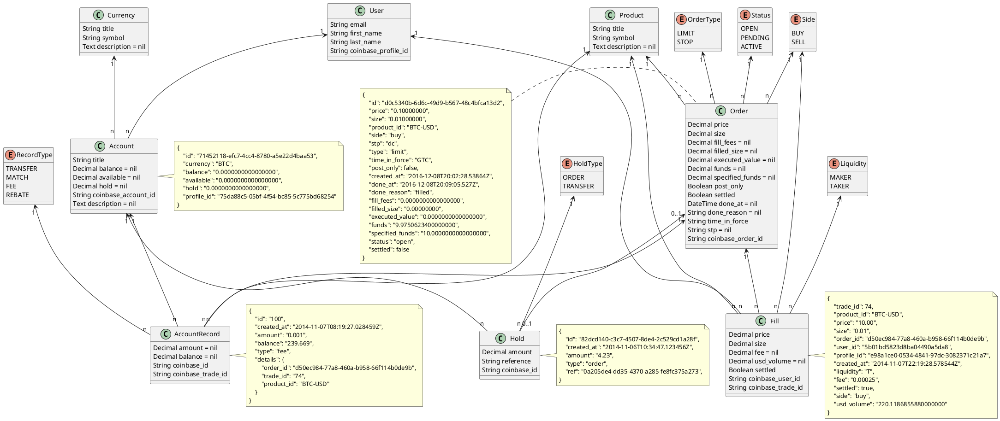

# Trading Portfolio class diagram

```plantuml
@startuml

enum RecordType {
    TRANSFER
    MATCH
    FEE
    REBATE
}

enum Liquidity {
    MAKER
    TAKER
}

enum Side {
    BUY
    SELL
}

enum Status {
    OPEN
    PENDING
    ACTIVE
}

enum OrderType {
    LIMIT
    STOP
}

enum HoldType {
    ORDER
    TRANSFER
}

class Currency {
    String title
    String symbol
    Text description = nil
}

class User {
    String email
    String first_name
    String last_name
    String coinbase_profile_id
}

class Account {
    String title
    Decimal balance = nil
    Decimal available = nil
    Decimal hold = nil
    String coinbase_account_id
    Text description = nil
}

class AccountRecord {
    Decimal amount = nil
    Decimal balance = nil
    String coinbase_id
    String coinbase_trade_id
}

class Product {
    String title
    String symbol
    Text description = nil
}

class Hold {
    Decimal amount
    String reference
    String coinbase_id
}

class Fill {
    Decimal price
    Decimal size
    Decimal fee = nil
    Decimal usd_volume = nil
    Boolean settled
    String coinbase_user_id
    String coinbase_trade_id
}

class Order {
    Decimal price
    Decimal size
    Decimal fill_fees = nil
    Decimal filled_size = nil
    Decimal executed_value = nil
    Decimal funds = nil
    Decimal specified_funds = nil
    Boolean post_only
    Boolean settled
    DateTime done_at = nil
    String done_reason = nil
    String time_in_force
    String stp = nil
    String coinbase_order_id
 }
 
User "1" <-- "n" Account
User "1" <-- "n" Fill

Account "1" <-- "n" Hold
Account "1" <-- "n" AccountRecord

Currency "1" <-- "n" Account

Product "1" <-- "n" AccountRecord
Product "1" <-- "n" Fill
Product "1" <-- "n" Order

Order "1" <-- "n" Fill
Order "1" <-- "n" AccountRecord
Order "0..1" <-- "0..1" Hold

Side "1" <-- "n" Fill
Side "1" <-- "n" Order

RecordType "1" <-- "n" AccountRecord
OrderType "1" <-- "n" Order
Liquidity "1" <-- "n" Fill
HoldType "1" <-- "n" Hold
Status "1" <-- "n" Order

note right of Account
    {
        "id": "71452118-efc7-4cc4-8780-a5e22d4baa53",
        "currency": "BTC",
        "balance": "0.0000000000000000",
        "available": "0.0000000000000000",
        "hold": "0.0000000000000000",
        "profile_id": "75da88c5-05bf-4f54-bc85-5c775bd68254"
    }
end note

note right of AccountRecord
    {
        "id": "100",
        "created_at": "2014-11-07T08:19:27.028459Z",
        "amount": "0.001",
        "balance": "239.669",
        "type": "fee",
        "details": {
            "order_id": "d50ec984-77a8-460a-b958-66f114b0de9b",
            "trade_id": "74",
            "product_id": "BTC-USD"
        }
    }
end note

note right of Hold
    {
        "id": "82dcd140-c3c7-4507-8de4-2c529cd1a28f",
        "created_at": "2014-11-06T10:34:47.123456Z",
        "amount": "4.23",
        "type": "order",
        "ref": "0a205de4-dd35-4370-a285-fe8fc375a273",
    }
end note

note left of Order
    {
        "id": "d0c5340b-6d6c-49d9-b567-48c4bfca13d2",
        "price": "0.10000000",
        "size": "0.01000000",
        "product_id": "BTC-USD",
        "side": "buy",
        "stp": "dc",
        "type": "limit",
        "time_in_force": "GTC",
        "post_only": false,
        "created_at": "2016-12-08T20:02:28.53864Z",
        "done_at": "2016-12-08T20:09:05.527Z",
        "done_reason": "filled",
        "fill_fees": "0.0000000000000000",
        "filled_size": "0.00000000",
        "executed_value": "0.0000000000000000",
        "funds": "9.9750623400000000",
        "specified_funds": "10.0000000000000000",
        "status": "open",
        "settled": false
    }
end note

note right of Fill
    {
        "trade_id": 74,
        "product_id": "BTC-USD",
        "price": "10.00",
        "size": "0.01",
        "order_id": "d50ec984-77a8-460a-b958-66f114b0de9b",
        "user_id": "5b01bd5823d8ba04490a5da8",
        "profile_id": "e98a1ce0-0534-4841-97dc-3082371c21a7",
        "created_at": "2014-11-07T22:19:28.578544Z",
        "liquidity": "T",
        "fee": "0.00025",
        "settled": true,
        "side": "buy",
        "usd_volume": "220.1186855880000000"
    }
end note
  
@enduml
```